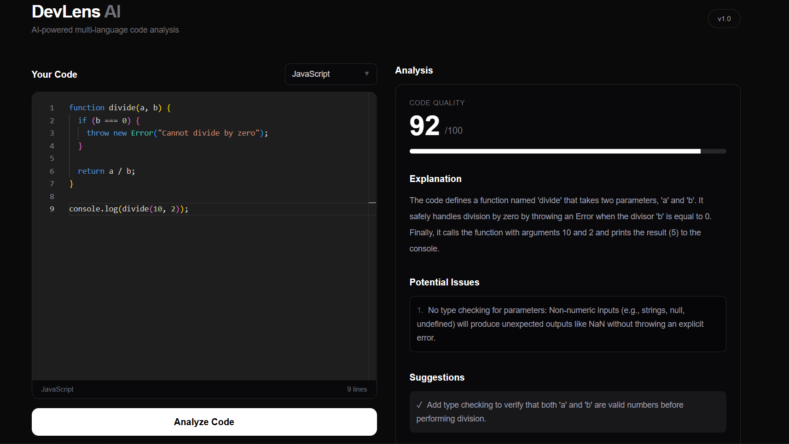
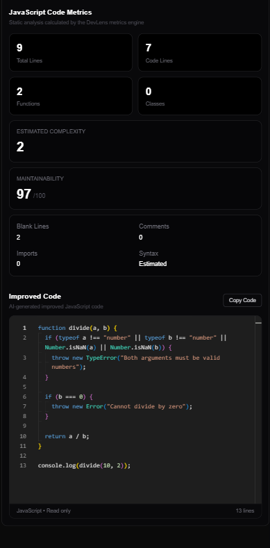

# DevLens AI

DevLens AI is an AI-powered multi-language code analysis tool built with Next.js, TypeScript, Gemini AI, Monaco Editor, and Python.

It analyzes source code, identifies potential issues, suggests improvements, generates improved code, and calculates static code metrics across multiple programming languages.

Python receives additional static analysis using Python AST and Radon.

---

## Screenshots

### Code Editor



### AI Analysis & Code Metrics



---

## Features

- AI-powered code review
- Multi-language code analysis
- Code quality scoring
- Code explanations
- Potential issue detection
- Improvement suggestions
- AI-generated improved code
- Syntax-highlighted Monaco code editor
- Read-only Monaco editor for improved code
- Searchable programming language selector
- Multi-language static code metrics
- Function detection
- Class detection
- Import detection
- Line statistics
- Estimated complexity analysis
- Maintainability scoring
- Python syntax validation
- Python cyclomatic complexity breakdown
- Copy improved code
- Responsive dark interface
- Error handling for AI and metrics services

---

## Code Metrics

DevLens includes its own metrics engine for analyzing source code.

Depending on the selected language, DevLens can calculate:

- Total lines
- Code lines
- Blank lines
- Comment lines
- Functions
- Classes
- Imports
- Complexity
- Maintainability score

### Python Analysis

Python receives deeper static analysis using:

- Python Abstract Syntax Tree (`ast`)
- Radon cyclomatic complexity
- Radon maintainability index
- Syntax validation
- Function and class discovery
- Import detection
- Per-block complexity analysis

### Other Languages

For non-Python languages, DevLens uses deterministic source-code analysis to estimate structural metrics and complexity.

These metrics are designed to provide useful code insights without relying on AI-generated metric values.

---

## AI Analysis

DevLens uses the Gemini API to provide:

- Code quality scoring
- Code explanations
- Potential issue detection
- Improvement recommendations
- Improved source code

The AI analysis and static metrics engine operate independently.

This allows DevLens to combine AI-based code review with deterministic source-code measurements.

---

## Tech Stack

### Frontend

- Next.js
- React
- TypeScript
- Tailwind CSS
- Monaco Editor

### Backend

- Next.js API Routes
- Node.js
- Python

### AI

- Google Gemini API

### Static Analysis

- Python AST
- Radon
- Custom multi-language metrics engine

---

## Architecture

```text
                     DevLens AI
                         │
                         ▼
                 Next.js Frontend
                         │
              ┌──────────┴──────────┐
              │                     │
              ▼                     ▼
        /api/analyze          /api/metrics
              │                     │
              ▼                     ▼
         Gemini API           Python Engine
              │                     │
              │              ┌──────┴──────┐
              │              │             │
              │          Python AST      Radon
              │
              └──────────┬──────────┘
                         │
                         ▼
                  Analysis Results
                         │
             ┌───────────┼───────────┐
             │           │           │
             ▼           ▼           ▼
          AI Review    Metrics   Improved Code
```

---

## Project Structure

```text
devlens-ai/
│
├── app/
│   ├── api/
│   │   ├── analyze/
│   │   │   └── route.ts
│   │   │
│   │   └── metrics/
│   │       └── route.ts
│   │
│   ├── icon.png
│   ├── globals.css
│   ├── layout.tsx
│   └── page.tsx
│
├── components/
│   └── CodeEditor.tsx
│
├── data/
│   └── languages.ts
│
├── python/
│   ├── analyzer.py
│   ├── requirements.txt
│   └── test_code.py
│
├── public/
│
├── .gitignore
├── package.json
├── next.config.ts
└── README.md
```

---


## How It Works

1. Select a programming language.
2. Paste source code into the Monaco Editor.
3. Click **Analyze Code**.
4. DevLens sends the code to the AI analysis API and metrics engine.
5. Gemini reviews the source code.
6. The DevLens metrics engine calculates static code metrics.
7. Results are displayed in the analysis panel.
8. DevLens generates improved code in a read-only Monaco Editor.
9. The improved code can be copied with one click.

---

## Security

API keys are stored in environment variables and are never exposed directly in the frontend.

The `.env.local` file should remain excluded from Git through `.gitignore`.

Do not commit API keys or other credentials to the repository.

---

## Limitations

Python receives deeper static analysis because DevLens uses Python's AST and Radon libraries.

Metrics for many other languages are currently estimated using deterministic source-code pattern analysis rather than full language-specific abstract syntax trees.

AI-generated analysis may also occasionally be incomplete or inaccurate and should be treated as developer assistance rather than a replacement for testing, linting, static analysis, or professional code review.

---

## Future Improvements

- Language-specific AST parsers
- More accurate complexity analysis for additional languages
- Analysis history
- File upload support
- Repository analysis
- Side-by-side code comparison
- Exportable analysis reports
- Authentication
- Saved projects
- Additional static-analysis integrations
- Improved mobile experience

---

## 👨‍💻 Author

https://github.com/guddies378

Designed and developed from the ground up as a software development project.

Built to learn, experiment, solve problems, and turn ideas into working software.

---

## 📜 License

© 2026 Mark James F. Manlangit. All Rights Reserved.